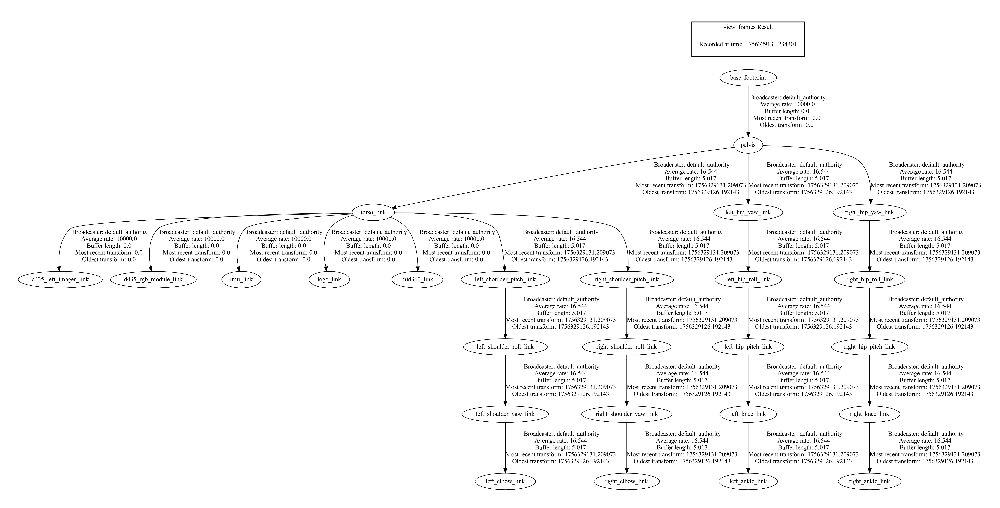

## Описание 
Данный репозиторий является ROS2-пакетом, который является urdf-описанием робота Unitree H1. Пакет разработан для ROS2.

## Граф связей, который описывается в urdf-файлах.

### `h1_with_hands.urdf`

### `h1.urdf`

## Лицензии  
- Основной код проекта распространяется под [лицензией  MIT](LICENSE).  
- Часть кода основана на [Unitree Robotics](https://github.com/unitreerobotics/unitree_ros?tab=readme-ov-file) ([BSD 3-Clause](LICENSE-ORIGINAL)).  
